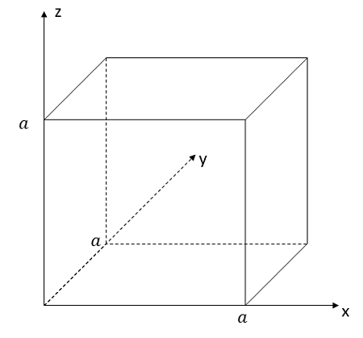
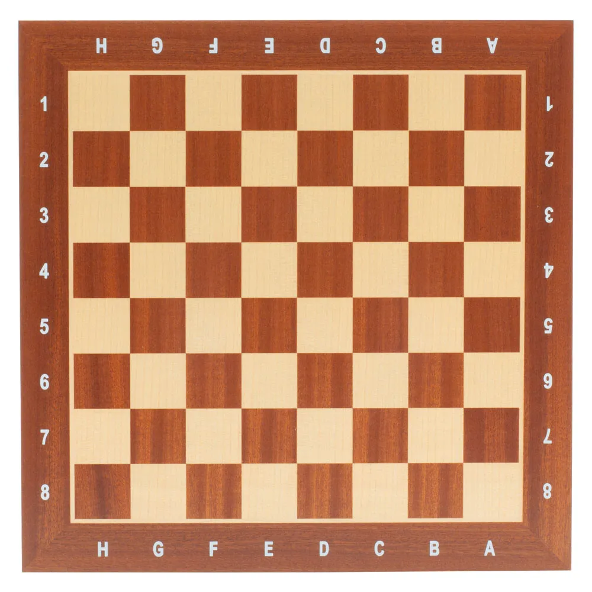
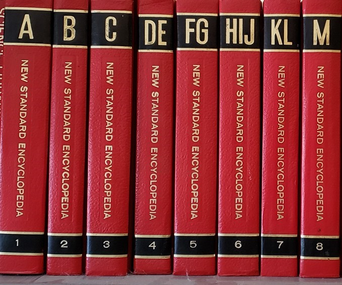

# CubeChess in C
## Purpose
This is similar to my other project which was doing this in python, but I realized that there were generally better ways I could go about representing the board, checking if a piece is already there, etc. I missed coding in C, so this was a good excuse to change the language as well.

This is my version of 3D Chess. It is not the same as the 4x4x4 stuff I'd seen on sale on Amazon, but rather a new game that tries to generalize the game of chess to 3D. This involves creating new pieces that take advantage of the newly added dimension, and the movements that you can do with them. In fact, I think there are more new pieces than there are old ones. For what it's worth, I have no knowledge of anyone else doing this, but if someone has, please let me know because I'd love to see how others tackle this.

## The General Idea
Picture a cube that is made up of smaller cubes (side length: 1 unit), such that the length, width and height of the big cube is 8 units long. We call this an 8x8x8 lattice, or, our game board.

The pieces, therefore, have 3 different directions they can theoretically move in, the x direction, the y direction, and the z direction.

Generalizing the pieces in traditional chess to 3D requires a slightly different view of how pieces move.
Generally, pieces in 2D chess move in three different ways:
- Straight (Rook, Bishop, Queen, King)
- L shaped (Knight)
- Straight but Diagonal Attack (Pawn)

We know that pieces like the King and Pawn have special limitations on their movement, and they also have the ability to do fancy things like castling and en-passant, and that pawn thing where the first move can be 2 squares, but bear with me here, as generalizing these to 3D still allows us to preserve these special cases, with the slight caveat that with castling, as there's some board logistics that I haven't quite figured out.

We can think of these three different movements as "passing through" various parts of the square they occupy, so, rather than describing them as I did above, we can reframe the movements like so:
- Passing through the edge (either x or y direction) (Rook, Queen, King, Pawn)
- Passing through the corner (xy direction) (Queen, King, Pawn (when attacking))
- Passing through one edge, and one corner in the direction of the edge passed (x direction twice, y direction once) (Knight)

The 3D generalization of a square is a cube. Cubes have three parts:
- Face (6)
- Edge (12)
- Vertices (8)

So, our pieces in 3D chess should be able to move through each of these parts of a cube.

## Board Setup
For the sake of simplicity, I will be using (x,y,z) notation to describe piece movements. I do think it would be better to have a kind of algebraic notation, and I have some ideas for that, but for now, it is easier to communicate in x,y, z.

Here are the meanings of each direction, using books lined up on a bookshelf:

The X direction is the "layer" of the board we are in.  Each unit in the x direction is like moving to the next book in line.
The Z direction is moving in the direction of the length of the spine of the book.
The Y direction is  moving perpendicular to the spine of the book, while remaining on the same book

The picture of the cube above is consistent with these directons, but it was only one cube, so I figured the book analogy would be more helpful.

## Pieces
Now, we generalize the pieces, using the scheme I outlined above, while keeping in mind how our 2D chess game works.
Note, c ∈ [1, 7]

|Name     |Colloquial Name|Movement Vector                                                                                                                                                                    |Attack Vector            |Character Representation (white, black)|
|---------|---------------|-----------------------------------------------------------------------------------------------------------------------------------------------------------------------------------|-------------------------|---------------------------------------|
|FRook    |Rook           |<X±c,0,0>, <0,Y±c,0>, <0,0,Z±c>                                                                                                                                                    |Same as Movement         |r, R                                   |
|ERook    |Priest         |<X±c,Y±c,0>, <0,Y±c,Z±c>, <X±c,0,Z±c>, <X±c,Y∓c,0>, <0,Y±c,Z∓c>, <X±c,0,Z∓c>                                                                                                       |Same as Movement         |t, T                                   |
|VRook    |Bishop         |<X±c,Y±c,Z±c>, <X±c,Y±c,Z∓c>, <X±c,Y∓c,Z±c>,  <X±c,Y∓c,Z∓c>                                                                                                                        |Same as Movement         |b, B                                   |
|FEKnight |Paladin        |<X+2,Y±1,0>, <X+2,0,Z±1>, <X-2,Y±1,0>, <X-2,0,Z±1>, <X±1,Y+2,0>, <0,Y+2,Z±1>, <X±1,Y-2,0>, <0,Y-2,Z±1>, <0,Y±1,Z+2>, <X±1,0,Z+2>, <0,Y±1,Z-2>, <X±1,0,Z-2>                         |Same as Movement         |p, P                                   |
|EVKnight |Dragon         |<X±2,Y±2,Z±1>, <X±2,Y±2,Z∓1>, <X±2,Y±1,Z±2>, <X±2,Y∓1,Z±2>, <X±1,Y±2,Z±2>, <X∓1,Y±2,Z±2>, <X±2,Y∓2,Z±1>, <X±2,Y∓2,Z∓1>, <X∓2,Y±1,Z±2>, <X∓2,Y∓1,Z±2>, <X±1,Y±2,Z∓2>, <X∓1,Y±2,Z∓2> |Same as Movement         |d, D                                   |
|FVKnight |Knight         |<X+2,Y±1,Z±1>, <X+2,Y±1,Z∓1>, <X-2,Y±1,Z±1>, <X-2,Y±1,Z∓1>, <X±1,Y+2,Z±1>, <X±1,Y+2,Z∓1>, <X±1,Y-2,Z±1>, <X±1,Y-2,Z∓1>, <X±1,Y±1,Z+2>, <X±1,Y∓1,Z+2>, <X±1,Y±1,Z-2>, <X±1,Y∓1,Z-2> |Same as Movement         |n, N                                   |
|King     |King           |Combine Rook, Priest, and Bishop, set c=1                                                                                                                                          |Same as Movement         |k, K                                   |
|Queen    |Queen          |Combine Rook, Priest, and Bishop                                                                                                                                                   |Same as Movement         |q, Q                                   |
|Pawn     |Pawn           |Rook, with c=2 on first move, c=1 otherwise                                                                                                                                        |Priest & Bishop, with c=1|i, I                                   |
|FEAdvisor|General        |Combine Rook and Priest                                                                                                                                                            |Same as Movement         |g, G                                   |
|EVAdvisor|Wizard         |Combine Priest and Bishop                                                                                                                                                          |Same as Movement         |w, W                                   |
|FVAdvisor|Duke           |Combine Rook and Bishop                                                                                                                                                            |Same as Movement         |u, U                                   |

## Initial Board
board setup is TBD.

Layer 1 (x=0):

|zy>|0  |1  |2  |3  |4  |5  |6  |7  |
|---|---|---|---|---|---|---|---|---|
|0  |x  |x  |x  |x  |x  |x  |x  |x  |
|1  |x  |x  |x  |x  |x  |x  |x  |x  |
|2  |x  |x  |x  |x  |x  |x  |x  |x  |
|3  |x  |x  |x  |x  |x  |x  |x  |x  |
|4  |x  |x  |x  |x  |x  |x  |x  |x  |
|5  |x  |x  |x  |x  |x  |x  |x  |x  |
|6  |x  |x  |x  |x  |x  |x  |x  |x  |
|7  |x  |x  |x  |x  |x  |x  |x  |x  |

Layer 2 (x=1):

|zy>|0  |1  |2  |3  |4  |5  |6  |7  |
|---|---|---|---|---|---|---|---|---|
|0  |x  |x  |x  |x  |x  |x  |x  |x  |
|1  |x  |x  |x  |x  |x  |x  |x  |x  |
|2  |x  |x  |x  |x  |x  |x  |x  |x  |
|3  |x  |x  |x  |x  |x  |x  |x  |x  |
|4  |x  |x  |x  |x  |x  |x  |x  |x  |
|5  |x  |x  |x  |x  |x  |x  |x  |x  |
|6  |x  |x  |x  |x  |x  |x  |x  |x  |
|7  |x  |x  |x  |x  |x  |x  |x  |x  |

Layer 3 (x=2):

|zy>|0  |1  |2  |3  |4  |5  |6  |7  |
|---|---|---|---|---|---|---|---|---|
|0  |x  |x  |x  |x  |x  |x  |x  |x  |
|1  |x  |x  |x  |x  |x  |x  |x  |x  |
|2  |x  |x  |x  |x  |x  |x  |x  |x  |
|3  |x  |x  |x  |x  |x  |x  |x  |x  |
|4  |x  |x  |x  |x  |x  |x  |x  |x  |
|5  |x  |x  |x  |x  |x  |x  |x  |x  |
|6  |x  |x  |x  |x  |x  |x  |x  |x  |
|7  |x  |x  |x  |x  |x  |x  |x  |x  |

Layer 4 (x=3):

|zy>|0  |1  |2  |3  |4  |5  |6  |7  |
|---|---|---|---|---|---|---|---|---|
|0  |x  |x  |x  |x  |x  |x  |x  |x  |
|1  |x  |x  |x  |x  |x  |x  |x  |x  |
|2  |x  |x  |x  |x  |x  |x  |x  |x  |
|3  |x  |x  |x  |x  |x  |x  |x  |x  |
|4  |x  |x  |x  |x  |x  |x  |x  |x  |
|5  |x  |x  |x  |x  |x  |x  |x  |x  |
|6  |x  |x  |x  |x  |x  |x  |x  |x  |
|7  |x  |x  |x  |x  |x  |x  |x  |x  |

Layer 5 (x=4):

|zy>|0  |1  |2  |3  |4  |5  |6  |7  |
|---|---|---|---|---|---|---|---|---|
|0  |x  |x  |x  |x  |x  |x  |x  |x  |
|1  |x  |x  |x  |x  |x  |x  |x  |x  |
|2  |x  |x  |x  |x  |x  |x  |x  |x  |
|3  |x  |x  |x  |x  |x  |x  |x  |x  |
|4  |x  |x  |x  |x  |x  |x  |x  |x  |
|5  |x  |x  |x  |x  |x  |x  |x  |x  |
|6  |x  |x  |x  |x  |x  |x  |x  |x  |
|7  |x  |x  |x  |x  |x  |x  |x  |x  |

Layer 6 (x=5):

|zy>|0  |1  |2  |3  |4  |5  |6  |7  |
|---|---|---|---|---|---|---|---|---|
|0  |x  |x  |x  |x  |x  |x  |x  |x  |
|1  |x  |x  |x  |x  |x  |x  |x  |x  |
|2  |x  |x  |x  |x  |x  |x  |x  |x  |
|3  |x  |x  |x  |x  |x  |x  |x  |x  |
|4  |x  |x  |x  |x  |x  |x  |x  |x  |
|5  |x  |x  |x  |x  |x  |x  |x  |x  |
|6  |x  |x  |x  |x  |x  |x  |x  |x  |
|7  |x  |x  |x  |x  |x  |x  |x  |x  |

Layer 7 (x=6):

|zy>|0  |1  |2  |3  |4  |5  |6  |7  |
|---|---|---|---|---|---|---|---|---|
|0  |x  |x  |x  |x  |x  |x  |x  |x  |
|1  |x  |x  |x  |x  |x  |x  |x  |x  |
|2  |x  |x  |x  |x  |x  |x  |x  |x  |
|3  |x  |x  |x  |x  |x  |x  |x  |x  |
|4  |x  |x  |x  |x  |x  |x  |x  |x  |
|5  |x  |x  |x  |x  |x  |x  |x  |x  |
|6  |x  |x  |x  |x  |x  |x  |x  |x  |
|7  |x  |x  |x  |x  |x  |x  |x  |x  |

Layer 8 (x=7):

|zy>|0  |1  |2  |3  |4  |5  |6  |7  |
|---|---|---|---|---|---|---|---|---|
|0  |x  |x  |x  |x  |x  |x  |x  |x  |
|1  |x  |x  |x  |x  |x  |x  |x  |x  |
|2  |x  |x  |x  |x  |x  |x  |x  |x  |
|3  |x  |x  |x  |x  |x  |x  |x  |x  |
|4  |x  |x  |x  |x  |x  |x  |x  |x  |
|5  |x  |x  |x  |x  |x  |x  |x  |x  |
|6  |x  |x  |x  |x  |x  |x  |x  |x  |
|7  |x  |x  |x  |x  |x  |x  |x  |x  |

Board template:

|zy>|0  |1  |2  |3  |4  |5  |6  |7  |
|---|---|---|---|---|---|---|---|---|
|0  |x  |x  |x  |x  |x  |x  |x  |x  |
|1  |x  |x  |x  |x  |x  |x  |x  |x  |
|2  |x  |x  |x  |x  |x  |x  |x  |x  |
|3  |x  |x  |x  |x  |x  |x  |x  |x  |
|4  |x  |x  |x  |x  |x  |x  |x  |x  |
|5  |x  |x  |x  |x  |x  |x  |x  |x  |
|6  |x  |x  |x  |x  |x  |x  |x  |x  |
|7  |x  |x  |x  |x  |x  |x  |x  |x  |
